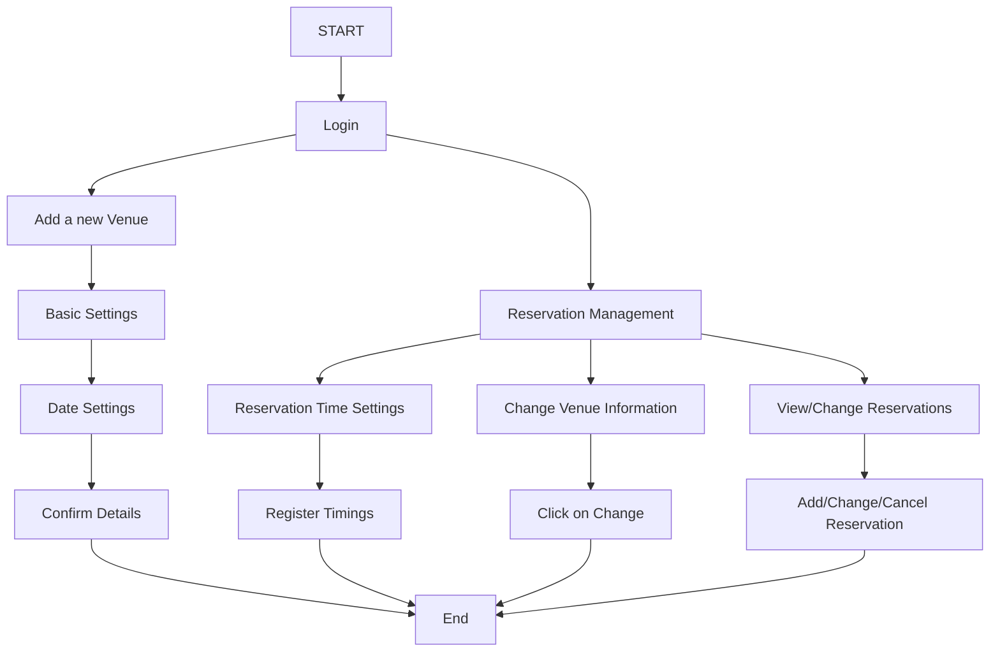

```mermaid
flowchart
   A[START] --> B[Login]
   B --> C[Reservation Management]
   B --> D[Add a new Venue]
   D --> E[Basic Settings]
   E --> F[Date Settings]
   F --> G[Confirm Details]
   C --> H[Change Venue Information]
   C --> I[View/Change Reservations]
   C --> J[Reservation Time Settings]
   J --> K[Register Timings]
   H --> L[Click on Change]
   I --> M[Add/Change/Cancel Reservation]
   G --> N[End]
   K --> N
   L --> N
   M --> N
```