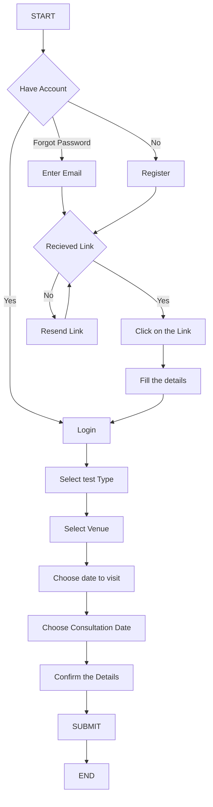

```mermaid
flowchart
    A[START] --> B{Have Account}
    B -->|Yes| C[Login]
    B -->|No| D[Register]
    B -->|Forgot Password| P[Enter Email]
    P -->E
    D --> E{Recieved Link}
    E -->|Yes| F[Click on the Link]
    F --> H[Fill the details]
    H --> C
    E -->|No| G[Resend Link]
    G --> E
    C --> I[Select test Type]
    I --> J[Select Venue]
    J --> K[Choose date to visit]
    K --> L[Choose Consultation Date]
    L --> M[Confirm the Details]
    M --> N[SUBMIT]
    N --> O[END]
```